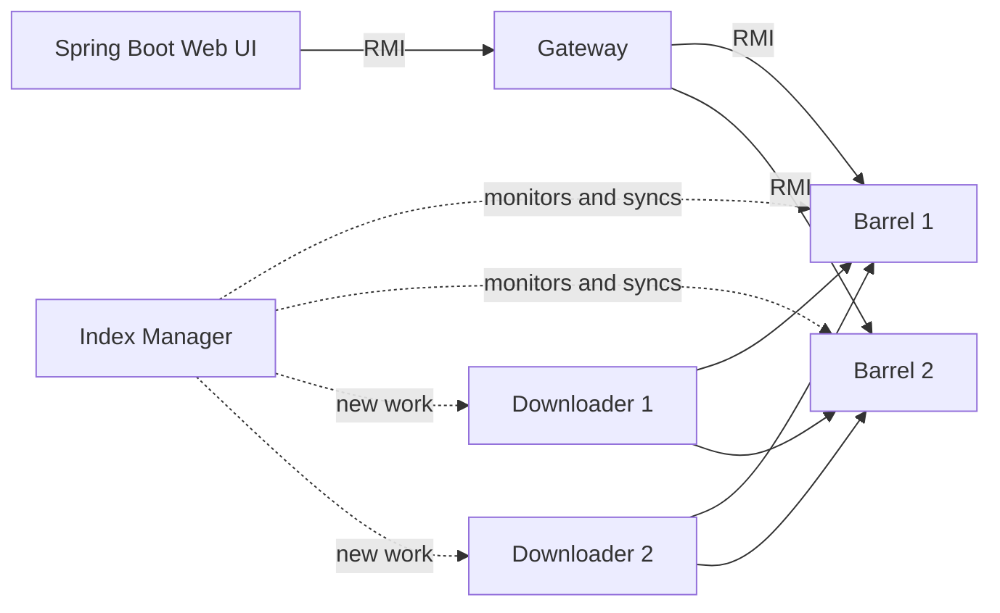

# Googol: Distributed Search Engine

A distributed web search engine written in Java. Downloaders crawl and send pages to replicated index barrels, a gateway exposes the search over RMI, and a Spring Boot web interface lets users search, browse in-links, follow real-time statistics and read Hacker News stories.

University project for the *Sistemas Distribuídos* (Distributed Systems) course, Computer Engineering (LEI), University of Coimbra, 2025.

## Features

- Distributed search through a gateway using Java RMI
- Results ranked by relevance (number of in-links) and paginated in groups of 10
- Index replicated across barrels, with automatic synchronization of a barrel that joins or comes back
- Page showing which pages link to a given URL (in-links)
- Real-time statistics page over WebSockets
- Hacker News top stories
- Optional page snippets generated by a local LLM through [Ollama](https://ollama.com)

## Architecture



| Component | Role |
|---|---|
| Downloader | Fetches web pages (Jsoup), extracts words and links and sends them to the barrels |
| Barrel (`IndexBarrel`) | Stores an index replica (word → URLs), the in-links and the URL queue; answers search queries |
| Index Manager | Knows which barrels are active, monitors them and synchronizes a new barrel from an existing one; notifies downloaders when there is work |
| Gateway | Single entry point: aggregates the results of the barrels and exposes the remote methods (search, in-links, statistics) |
| Web UI | Spring Boot + Thymeleaf application that talks to the gateway |
| Client | Command-line client |

### Fault tolerance and replication

Every barrel holds a full replica of the index. The Index Manager keeps checking the barrels defined in `config.properties`; when one becomes available again, it is synchronized from a running barrel (index, visited URLs and pending URLs). The gateway keeps querying the remaining barrels if one fails.

## Tech Stack

Java 21 · Spring Boot 3.3 · Thymeleaf · Java RMI · WebSockets · Jsoup · Apache HttpClient 5 · Maven · Ollama (optional)

## Project Structure

```
java/
├── pom.xml
└── src/main/
    ├── java/
    │   ├── barrel/         # IndexBarrel, IndexManager
    │   ├── downloader/     # crawler
    │   ├── gateway/        # RMI gateway and shared types
    │   ├── client/         # command-line client
    │   ├── external_api/   # Hacker News and Ollama clients
    │   ├── common/         # configuration loader
    │   ├── resources/      # config.properties (read by the RMI components)
    │   └── web/            # Spring Boot app: controller, service, websocket, dto
    └── resources/
        ├── templates/      # Thymeleaf pages
        └── application.properties
```

## Getting Started

### Prerequisites

- Java 21 and Maven
- (Optional) [Ollama](https://ollama.com) running locally with the `gemma3:270m` model, for snippets

### Installation

```bash
cd java
mvn clean package
```

This builds `target/googol-1.0-SNAPSHOT.jar` and copies the dependencies to `target/lib`.

### Configuration

- `src/main/resources/config.properties`: addresses and ports of the manager, gateway, barrels and downloaders (the RMI services). The default is everything on `localhost`.
- `src/main/resources/application.properties`: web server address and port, and the Ollama URL.

Both files currently contain the IP addresses used in the lab network. Change them to `localhost` to run everything on one machine.

### Usage

Start the RMI services, each one in its own terminal, from the `java` folder (use `;` instead of `:` in the classpath on Windows):

```bash
java -cp "target/classes:target/lib/*" barrel.IndexBarrel 1
java -cp "target/classes:target/lib/*" barrel.IndexManager
java -cp "target/classes:target/lib/*" downloader.Downloader 1
java -cp "target/classes:target/lib/*" gateway.Gateway
```

Then start the web interface:

```bash
java -jar target/googol-1.0-SNAPSHOT.jar
```

Open http://localhost:8080. The `run_all.cmd`, `run_maquina1.cmd` and `run_maquina2.cmd` scripts start the same services on Windows, in one or two machines.

## Authors

Simão Carvalho, Tiago Durães · University of Coimbra · Computer Engineering · 2025
